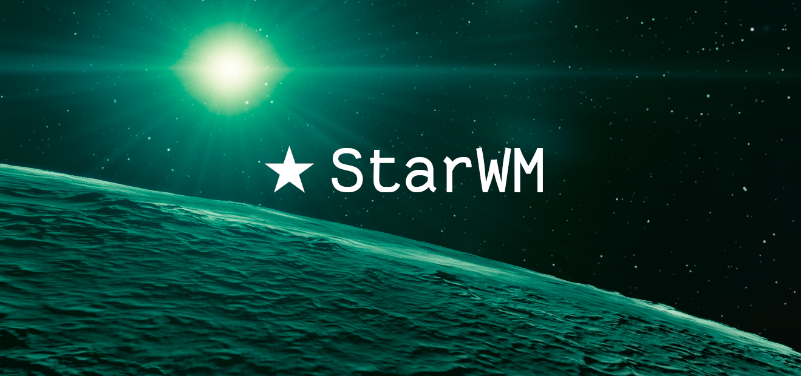
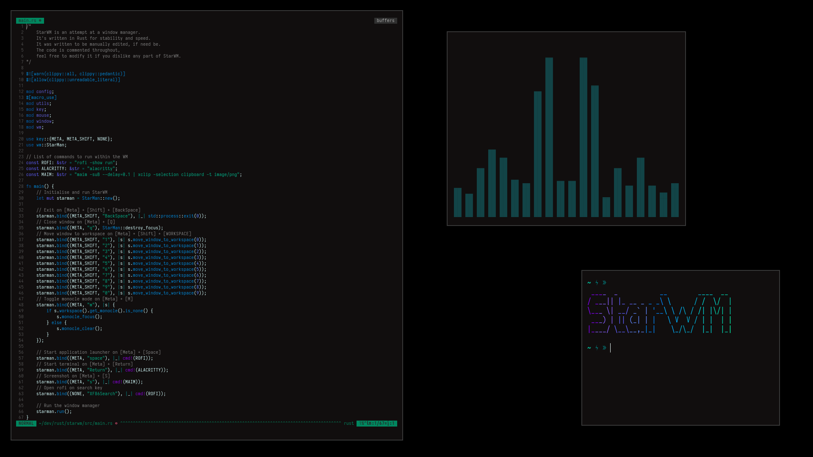

<p align="center">
  <a href="#">
    
  </a>
</p>

**Please Note**: *StarWM is not in a very usable state as of yet. It is for this reason that there is very little documentation as it will most likely change quite quickly.*

<hr>


# StarWM
StarWM is an extensible window manager written in Rust.



# Why?
StarWM started because I was curious to see how practical Rust would be in critical userspace software, and I wanted to experiment with XCB for a long time. If you are a fellow Rustacean, and you'd like to have a crack at building your own window manager, feel free to go to the initial commit and work from there, or if you understand the code as a whole, feel free to take it for yourself and modify it to your liking, just be sure to keep it free and open source under the GPL3 license if you plan to redistribute your copy!

# Plans?
There are plans to make this extensible, possibly through a Lua interpreter. We are looking into if it could function perfectly as both a tiling and floating window manager, perhaps I could add window decorations too.

# Installation
Please see [INSTALL.md]()

Installation assumes you have an up to date Rust toolchain installed https://rust-lang.org. 

You will also need to have several X development libraries. They're usually under something like `libxcb-devel` and `libx11-devel`. Have a search in your package manager. There might be other libraries needed, but I'm not totally sure.

```sh
git clone https://github.com/StarWM/StarWM.git
cd StarWM
cargo build --release
sudo cp target/release/starwm /usr/bin/starwm
```
After following the above guide, you will have installed StarWM.
If you wish to add it into a desktop manager, then you can't just yet.

The best way to get it started is to add this:

```sh
exec starwm
```

To the bottom of your `~/.xinitrc` file.

From here you can either reboot into it, provided that you have disabled your desktop manager and added `startx` to your shells profile file.
Alternatively, you can boot into a TTY and then run `startx` and you'll be good to go.
